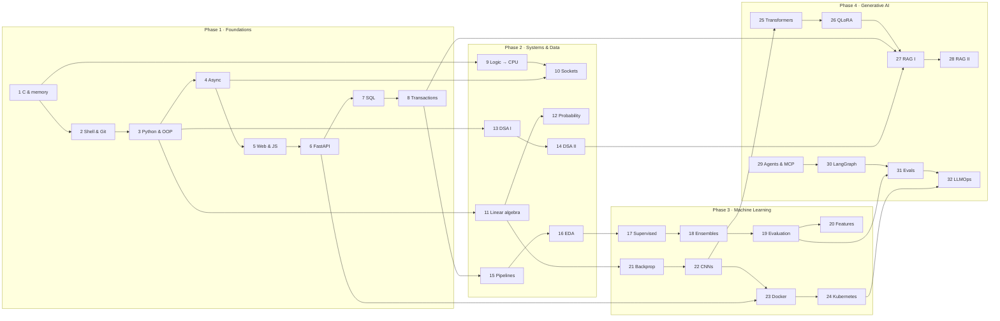

Nothing here is filler, and nothing is out of order. Each week is a prerequisite for something
specific later — the dependency arrows are the reason C comes before Python and probability
comes before evaluation.

## The payoffs you won't see coming

| You learn it in | It comes back in |
| --- | --- |
| Week 1 — how a float is stored in bits | Week 26 — why INT4 quantization loses accuracy |
| Week 8 — B-Tree indexes | Week 27 — HNSW vector indexes: same idea, different distance |
| Week 8 — idempotency under retries | Week 32 — a resumed agent that must not charge a card twice |
| Week 11 — low-rank approximation via SVD | Week 26 — LoRA is exactly this |
| Week 12 — bootstrap confidence intervals | Week 33 — is model B actually better than model A? |
| Week 14 — heaps and graph search | Week 27 — HNSW's candidate queue |
| Week 19 — Recall@k and NDCG | Week 27 — measuring whether your retrieval works |
| Week 22 — transfer learning on a frozen backbone | Week 26 — fine-tuning a frozen LLM with an adapter |
| Week 24 — dynamic batching in model serving | Week 26 — vLLM's continuous batching |
